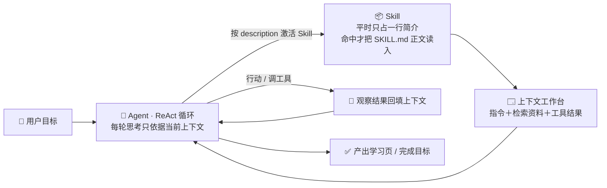

# bigdata-ai-course

> 大数据与人工智能课程 · 作业 1：用 AI 构建个人概念学习资料生成 Skill
>
> 仓库地址：<https://github.com/Xuanruoxue/bigdata-ai-course>

---

## 一、仓库用途

这是我的个人学习 + 作品集仓库，核心包含两样东西：

1. **一个可复用的项目级 Skill —— `concept-microcourse`**：把任意一个概念做成「单文件 HTML 微课程」——来源可核查、带图解、带三层自测。它可以接收**新的概念**作为输入，不是只为本仓库三个概念写的一次性提示词。
2. **由该 Skill 生成并经过人工核查的学习资料**：覆盖 Agent、大模型的上下文、Skill 三个概念，外加一份三概念关系说明。

仓库可作为后续课程项目的个人工具基础，也是「我会用 AI 组织、核查、沉淀学习任务」的过程证据。

---

## 二、目录结构与 Skill 存放路径

```text
bigdata-ai-course/
├── .workbuddy/
│   └── skills/
│       └── concept-microcourse/        # ← 项目级 Skill
│           ├── SKILL.md                #   name/description YAML + 工作流程（场景/输入/步骤/校验/交付）
│           └── references/
│               ├── design-tokens.md    #   Anthropic/Claude 设计 token（视觉数值）
│               └── quiz-engine.md      #   三层自测引擎模板
├── learning-materials/
│   ├── agent.html                      # Agent 概念速学页（Skill 产出）
│   ├── agent.md                        # Agent 概念讲义（人工整理的 .md 版）
│   ├── llm-context.html                # 大模型的上下文 速学页（Skill 产出）
│   ├── skill.html                      # Skill 概念速学页（Skill 产出）
│   └── concept-relationship.html       # 三概念关系说明
├── README.md
└── .gitignore
```

**项目级 Skill 规则**：把含 `SKILL.md` 的目录放进仓库根目录的 `.workbuddy/skills/<技能名>/`，即为本项目级 Skill；`SKILL.md` 顶部 YAML 至少写 `name` 与 `description`，正文是完整可执行的流程。

---

## 三、如何在 WorkBuddy 中调用它

1. 在 WorkBuddy 中打开本仓库（根目录即仓库根）。
2. Skill 会被自动识别并纳入候选：平时只占用一行 `description`，用于判断“何时该用”。
3. 直接对话即可触发，例如：
   - “用 concept-microcourse 把『向量数据库』做成速学页”
   - “用概念学习技能，3 分钟搞懂 RAG，要图、要自测”
   - “用刚才那个 Skill 再做一页讲 X 的”
4. 触发后 Skill 会执行：澄清概念范围 → 检索一手/权威来源 → 编排内容 → 套用设计 token 出单文件 HTML → 内嵌三层自测 → 交付前脚本/字号/id 自检。
5. 产出统一落在 `learning-materials/<concept>.html`，可直接用浏览器打开。

> 说明：本项目级 Skill 随仓库走——换机器克隆仓库即可继续使用，也可 fork 或迁移到其他 WorkBuddy 项目。

---

## 四、已生成的学习资料

| 文件 | 内容要点 | 生成与核查 |
|---|---|---|
| `learning-materials/agent.html` | Agent 是什么（一句话 + 三种权威口径）、五部件解剖、ReAct 循环、数据分析场景、边界辨析、12 题分层自测、来源脚注 | Skill 生成于 2026-09-03；09-06 复核通过 |
| `learning-materials/agent.md` | 同概念 .md 讲义：个人解释 / 核心机制 / 应用场景 / 易混淆点与边界 / 8 条可核查来源 | 2026-09-03 人工整理 |
| `learning-materials/llm-context.html` | 上下文窗口是什么、窗口里装什么、为何有限（n² 注意力/KV 缓存/训练长度）、Lost-in-the-Middle 与上下文腐烂、长会话“续命”场景、12 题分层自测、来源脚注 | Skill 生成于 2026-09-06，人工核查 |
| `learning-materials/skill.html` | Skill 定义、SKILL.md 目录结构、渐进式披露三级原理、与 MCP/提示词/RAG 辨析、本仓库 concept-microcourse 实践场景、12 题分层自测、来源脚注 | Skill 生成于 2026-09-06，人工核查 |
| `learning-materials/concept-relationship.html` | 三概念“执行者 → 工作台 → 知识抽屉”关系主线、一览表、两条主线解释、本仓库真实链路、思考题 | 2026-09-06 人工整理 |

每份 HTML 页脚均列出**可核查来源链接**并标注核对日期；所有页面自带“学完 → 自测”路径，可直接双击打开使用。

---

## 五、三个概念之间的关系

一句话概括：**上下文是 Agent 的工作台，Skill 是把“成熟做法”放进工作台的高效抽屉。**



- **上下文如何影响 Agent 的工作**：Agent 每一轮“想下一步”都受限于上下文窗口——没检索到就不知道，塞太多噪音就抓不住重点（U 型效应、上下文腐烂），历史太长规则会“沉底”。因此 Agent 工程质量取决于**上下文工程**（每个推理点维持最小的高信号 token 集），而不只是模型本身。
- **Skill 如何沉淀可复用的任务知识**：把一次成功的做法写成 `SKILL.md`（步骤 + 规范 + 可选脚本），Agent 每次按同一流程执行，产出稳定、可版本管理、可分享；平时不长期占用上下文（渐进式披露），把“经验”从某一次对话里拿出来，变成仓库里**可复用的资产**。

详见 `learning-materials/concept-relationship.html`。

---

## 六、使用 AI 后，我做了哪些人工核查与修改

1. **来源不伪造、逐条核验**：为本次新增的 `llm-context.html`、`skill.html`、`concept-relationship.html` 检索并**直接打开来源页面**核实（如 Anthropic《Introducing Agent Skills》发布于 2025-10-16、开放标准 agentskills.io 于 2025-12-18 发布、Anthropic 工程博客与 Google 官方长上下文科普等），确认链接可用、日期与说法一致后才写入脚注。
2. **逐页通读、统一口径**：全文通读三份新资料，统一概念表述（如 Skill 的 YAML 必填字段、渐进式披露三级；上下文的注意力预算、U 型现象、压缩与按需检索），避免概念 A 页与 B 页互相矛盾。
3. **技术自检**：对每个 HTML 用 Node 做 `<script>` 纯语法检查；`grep` 确认无小于 12px 的字号；核对 12 道自测题的题干/选项/答案/解析与 id 引用一致。
4. **结构整理**：把 09-03 生成的 `agent-learning.html`、`AI-Agent概念讲解.md` 规范移入 `learning-materials/`（重命名为 `agent.html`、`agent.md`），并按此更新 Skill 的输出规则为 `learning-materials/<concept>.html`。
5. **补全说明**：为 Skill 的 `SKILL.md` 增加“输入与输出”一节；重写本 README。
6. **版本与安全**：用 `.gitignore` 排除 `.workbuddy/memory/` 等本地会话内容与各类密钥文件；提交前复核无 API Key、密码或个人隐私入库。

---

## 七、Git 与版本说明

- 分支：`main`；远端：`origin → https://github.com/Xuanruoxue/bigdata-ai-course.git`
- 提交内容：项目级 Skill 源码（`.workbuddy/skills/`）、学习资料（`learning-materials/`）、`README.md`、`.gitignore`
- 已排除：`.workbuddy/memory/`（个人学习日志）、密钥类文件、编辑器与系统杂项（详见 `.gitignore`）

---

## 八、如何继续迭代

想学新概念（如 RAG、向量数据库、MCP……）：

1. 在 WorkBuddy 中打开本仓库，直接说“用 concept-microcourse 学一下 XXX”；
2. 人工**通读 + 核验来源 + 做自测题**，发现不准确就请 AI 修改；
3. 新产出落入 `learning-materials/`，提交并 push，即可继续沉淀个人资料库。
