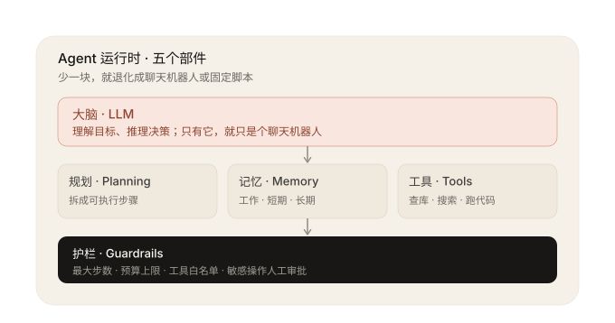
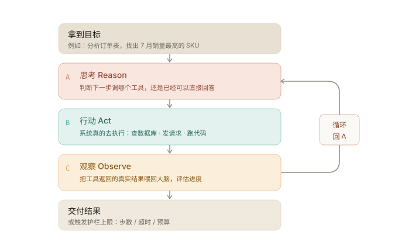
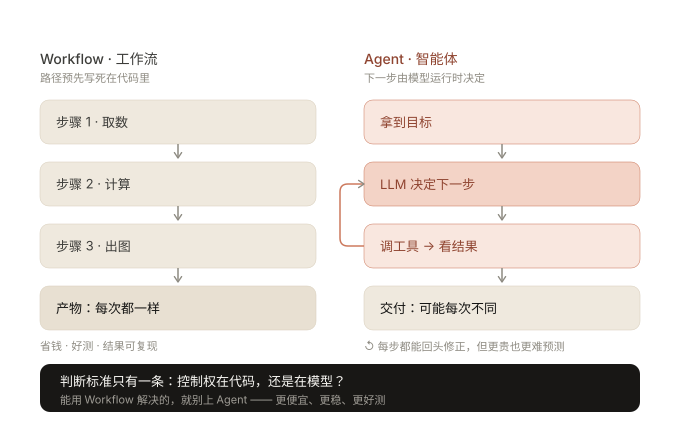

# AI Agent(智能体)概念讲义

> 适用范围:大数据与人工智能课程 · 概念学习与资料核查
> 整理日期:2026-09-03 · 最近更新:2026-09-10
> 说明:本文为概念讲解存档,含 3 张图解;所有引用来源见文末"文献资料";自测题见第六节。

---

## 目录

1. 概念的个人解释
2. 核心机制与组成
3. 具体应用场景
4. 容易混淆的问题与使用边界
5. 文献资料(官方文档与学术论文)
6. 自测(三层 · 12 题,含答案解析)

> 图解索引:图 1 五个部件架构 · 图 2 ReAct 决策循环 · 图 3 Workflow 与 Agent 的路径差异(原图见 `assets/` 目录)。

---

## 一、概念的个人解释

字面上 Agent 是"行动者、代理人"。在 AI 领域,可以把它浓缩为一句话:

> **Agent = LLM(大脑)+ 工具(手)+ 记忆(记事本)+ 自主决策循环(做事的节奏)**,是能"自己决定怎么做"并"真的去做"的系统。

### 1.1 一个通俗类比

| 对象 | 类比 | 特点 |
|---|---|---|
| 聊天机器人 | 只动口的"顾问" | 问什么答什么,不能动手办事,没有行动闭环 |
| **Agent** | 有手有脚的"实习生" | 领到目标后自己拆解任务、查资料、调系统、验证结果,失败会换方案 |

关键差异不在"会不会说话",而在 **自主性(Autonomy)** 与 **行动闭环**:感知 → 思考 → 行动 → 观察反馈 → 再思考。

### 1.2 概念边界提示

2024 年之后,业界(尤以 Anthropic 为代表)把这一大范畴统称为 **"Agentic Systems(智能体系统)"**,并在其中**严格区分两种架构**:

- **Workflow(工作流)**:LLM 与工具通过**预先写死的代码路径**编排。
- **Agent(智能体)**:LLM **在运行时动态决定**自己的流程与工具使用,保持对"如何完成任务"的控制。

通俗理解:区别在于"路径由代码定"还是"路径由模型定"。详见第四节。

---

## 二、核心机制与组成

### 2.1 五个组成要素

| 组成 | 作用 | 通俗说法 |
|---|---|---|
| **大模型 LLM** | 推理引擎:理解目标、拆解步骤、决定下一步 | 大脑 |
| **工具 Tools** | 执行具体动作:查数据库、写代码、搜网页、调 API;通过 Function Calling 或 MCP(统一工具协议)接入 | 手 |
| **记忆 / 状态** | 短期(上下文窗口)记录过程;长期(数据库 / 向量库)记录用户偏好与历史 | 记事本 |
| **决策循环** | 核心机制,业界称 **ReAct 模式**:Reason(思考)→ Act(行动)→ Observe(观察) | 做事的节奏 |
| **运行时与护栏** | 编排循环、错误处理、Guardrails(输入输出校验)、Human-in-the-loop(人工审批点) | 监工与刹车 |



*图 1 · 五个部件：大脑负责想，规划负责拆，记忆负责记，工具负责做，护栏兜底。*

### 2.2 核心决策循环(伪代码)

```python
state = 初始上下文(用户目标 + 历史记忆 + 可用工具清单)
while not done:
    thought = LLM(state)          # 思考:下一步做什么?
    if thought == "直接回答":      # 已足够,结束循环
        break
    result = call_tool(thought.tool, thought.args)   # 行动:调用某个工具
    state += result               # 观察:把反馈写回状态,进入下一轮
```

这就是"智能体化"的本质——不是一次性生成答案,而是**多轮"想一步、做一步、看一步"**的循环。



*图 2 · ReAct 循环：A 思考 → B 行动 → C 观察 → 回到 A，直到完成或触发护栏上限。*

### 2.3 关键理论与主流框架

- 理论源头:**ReAct 论文**(2022,Google),提出"让模型边推理边行动边观察"的模式。
- 主流工程框架:LangGraph、OpenAI Agents SDK、微软 AutoGen、Claude Agent SDK 等。
- 工具接入标准:**MCP(Model Context Protocol)**,由 Anthropic 提出,用于统一外部工具/数据的接入协议。

---

## 三、具体应用场景:数据分析 Agent

以本课程的大数据背景为例,描述一个"**季度销量下滑归因分析 Agent**":

1. **下达开放式目标**:用户说"帮我分析三季度 A 系列销量为什么比二季度下滑,并出报告。"
2. **Agent 规划**:需要订单明细、去年同期对比、是否改价 / 停促销等信息。
3. **行动 1**:调用 SQL 工具查询订单库,得到分区销量 → **观察**:下滑集中在华东区域。
4. **再思考 + 行动 2**:写 Python 工具做"品类 × 区域"交叉统计并出图。
5. **再行动 3**:数据仍解释不了,调用外部搜索 / 舆情工具查该品类近期负面信息。
6. **汇总**:综合所有工具结果,输出带图表的归因报告与下一步建议。

关键点:**第 3~5 步"先查什么、要不要再查"都由模型根据上一步结果动态决定**,而不是程序员预先写死的 if-else。

### 更复杂的形态:多 Agent 协作

当任务足够复杂,可拆成多个专职 Agent 协作,例如:

- "数据工程 Agent":负责取数清洗;
- "分析师 Agent":负责统计建模;
- "汇报 Agent":负责撰写报告。

多个 Agent 之间通过 Handoff(交接)或共享状态协调工作(如 OpenAI Agents SDK 的多 Agent 模式)。

---

## 四、容易混淆的问题与使用边界

### 4.1 四组高频混淆点

**1. Agent vs 聊天机器人 / 单次工具调用**

会接 Function Calling、会"查一次资料再作答"的多轮对话,不一定是 Agent。Agent 的判断标准是**多步、由模型主导的决策闭环**。单步"检索后作答"通常叫 **增强型 LLM(Augmented LLM)**。

**2. Agent vs RAG(检索增强生成)**

- RAG 只解决"从知识库取相关文本"这一个动作,是一种工具 / 能力;
- Agent 是"编排者",可以把 RAG、搜索、代码执行都当作工具调用。
- 两者不是同一层概念:**RAG 常被 Agent 当作其中一条工具**。

**3. Agent vs Workflow / Chain(流水线)**

判断标准:**控制权在代码还是在模型?**

| | Workflow(工作流) | Agent(智能体) |
|---|---|---|
| 执行路径 | 代码预先写死,步骤固定 | 模型运行时动态决定 |
| 确定性 | 高 | 低 |
| 适用 | 任务固定、步骤可预测 | 开放式、步数不可预测 |
| 成本与延迟 | 较低、可控 | 较高,随步数增长 |

工程建议(Anthropic):**能用简单 Workflow 就不要上真 Agent**;自主性换来的是不确定的成本与错误复合风险。



*图 3 · 分水岭：路径写死在代码里，还是由模型运行时决定。*

**4. 单 Agent vs 多 Agent;自主 ≠ 智能**

- 多 Agent 不一定更强:通信开销、成本、错误复合都可能增加,除非子任务边界清晰(不同角色分工)才值得。
- Agent **没有"意图"或"意识"**,本质是"LLM 决定调哪个工具的循环"。
- **自主性是一个刻度盘**(从 0 人工到全自动),不是有 / 无的开关。

### 4.2 使用边界:什么时候不该用 Agent

- **任务固定、步骤可预测**:用 Workflow 或普通程序,更快、更便宜、更可控。
- **对延迟 / 吞吐敏感**(如高并发在线推理):LLM 决策循环太慢。
- **错误不可逆或代价高**(资金操作、删除数据、对外发言):必须加 Human-in-the-loop 审批点与护栏。
- **缺少可校验反馈**:每步模型决策都会放大错误率,若没有环境反馈(如代码测试、SQL 结果)或评估手段,不宜放开自主。
- **长任务超上下文**:需额外的记忆压缩 / 外挂存储设计。

### 4.3 什么情况适合用 Agent

1. 开放式问题、所需步数不可预测;
2. 每一步都能从环境拿到"真实反馈"来校验进展;
3. 已有护栏与停止条件(如最大迭代次数),可随时叫停。

---

## 五、文献资料(官方文档与学术论文)

> 收录原则:只收**一手来源**——机构官方文档与可公开检索的学术论文原文;博客、新闻、百科等二手材料另列于第六节,不作为引用依据。
> 核对方式:所有链接于 2026-09-10 逐条联网访问确认可达;论文的标题、作者与提交日期取自 arXiv 官方 API 返回值。

### (一)官方文档与规范

1. **Anthropic《Building Effective AI Agents》**(2024-12-19)
   Agent 与 workflow 的分界、五种可组合模式。
   https://www.anthropic.com/engineering/building-effective-agents

2. **OpenAI《Building agents》官方指南**
   Agent 定义与三要素:instructions、guardrails、tools。
   https://developers.openai.com/tracks/building-agents

3. **OpenAI Agents SDK 官方文档**
   含 Agent、Handoff、Guardrails、Sessions 等核心概念与代码示例。
   https://openai.github.io/openai-agents-python/

4. **Microsoft Learn《Agents in Microsoft Foundry》**
   企业级 agent 服务与运行时说明。
   https://learn.microsoft.com/en-us/azure/ai-foundry/agents/overview

5. **Model Context Protocol(MCP)官方规范**
   统一 Agent 接入外部工具与数据的开放标准。
   https://modelcontextprotocol.io/

### (二)学术论文(arXiv 可查)

1. **ReAct: Synergizing Reasoning and Acting in Language Models**
   Shunyu Yao 等,2022-10-06,arXiv:2210.03629 —— Agent 决策循环(Reason → Act → Observe)机制出处。
   https://arxiv.org/abs/2210.03629

2. **Reflexion: Language Agents with Verbal Reinforcement Learning**
   Noah Shinn 等,2023-03-20,arXiv:2303.11366 —— 失败后语言反思再重试。
   https://arxiv.org/abs/2303.11366

3. **Tree of Thoughts: Deliberate Problem Solving with Large Language Models**
   Shunyu Yao 等,2023-05-17,arXiv:2305.10601 —— 「规划」部件的多路径搜索思路。
   https://arxiv.org/abs/2305.10601

4. **Toolformer: Language Models Can Teach Themselves to Use Tools**
   Timo Schick 等,2023-02-09,arXiv:2302.04761 —— 模型自主调用工具的代表性工作。
   https://arxiv.org/abs/2302.04761

5. **A Survey on Large Language Model based Autonomous Agents**
   Lei Wang 等,2023-08-22,arXiv:2308.11432 —— 智能体「规划—记忆—工具」组成框架综述。
   https://arxiv.org/abs/2308.11432

### (三)延伸阅读(非一手,仅作线索)

1. **LangChain Agents 概念文档**(框架官方文档):https://docs.langchain.com/oss/python/langchain/agents
2. **Lilian Weng(OpenAI)《LLM Powered Autonomous Agents》**(个人博客):https://lilianweng.github.io/posts/2023-06-23-agent/
3. **Simon Willison《The Lethal Trifecta for AI Agents》**(个人博客):https://simonwillison.net/2025/Jun/16/the-lethal-trifecta/
4. **Wikipedia "Intelligent Agent"**(百科,仅用于追溯经典 AI 教材概念):https://en.wikipedia.org/wiki/Intelligent_agent

---

## 六、自测(三层 · 12 题)

> **难度分三层**:🟢 入门(基础)　→　🟡 进阶(原理与实战)　→　🔴 挑战(细节辨析)。
> **达标线**:入门 4/4 + 进阶 ≥3 + 挑战 ≥2。
> **用法**:先自己选,选完再对照本节末尾的「答案与解析」;错题重点看解析里"错在哪"。

### 🟢 入门(4 题 · 基础 · 需全对)

**1. 看到“Agent 智能体”这个词，它和普通聊天机器人最根本的差别在哪？**

- A. Agent 用了参数更多的模型
- B. 聊天机器人只能聊天，Agent 会调工具、看结果、再决定下一步
- C. Agent 的回复速度更快
- D. Agent 一定需要联网

**2. Agent 最经典的“配方”是哪一组？**

- A. 提示词＋数据库＋网页
- B. 脚本＋按钮＋定时任务
- C. LLM＋规划＋记忆＋工具
- D. 更大的模型＋更多的训练数据

**3. 把 Agent 比作一个实习生，它的“大脑”对应下面哪个？**

- A. 存放记忆的数据库
- B. 大语言模型（LLM），负责理解和推理
- C. 能调用的 API 清单
- D. 跑代码的操作系统

**4. Agent 靠什么真正影响现实世界，而不是只“嘴上说说”？**

- A. 把提示词写得特别长
- B. 记住更多轮对话
- C. 调用工具：查数据库、搜网页、发邮件、执行代码
- D. 换成更贵的模型

---

### 🟡 进阶(4 题 · 原理与实战 · 达标 ≥3)

**5. ReAct 这个名字来自 Reason＋Act，它每一轮的正确顺序是？**

- A. 先行动，再看结果，最后才想为什么要做
- B. 先观察，再思考，然后直接结束
- C. 一次推理就想清全部步骤，不用循环
- D. 先思考该做什么 → 调工具行动 → 看结果，再回到思考

**6. 按常见分法，Agent 的记忆分成哪几类？**

- A. 工作记忆、短期记忆、长期记忆
- B. 只分硬盘和内存
- C. 对话记录和文件两类
- D. 提示词和模型参数两类

**7. Agent 一旦陷入死循环最烧钱，下面哪种设计最能兜住这个风险？**

- A. 把系统提示词写得更长
- B. 换成响应更快的模型
- C. 护栏：设步数上限、超时时间、预算上限
- D. 把上下文窗口扩到最大

**8. 新加坡 GovTech 把 Agent 的内部过程概括成哪四个动作？**

- A. 观察 → 推理 → 行动 → 学习
- B. 编译 → 运行 → 报错 → 修复
- C. 提问 → 回答 → 打分 → 结束
- D. 抓取 → 存储 → 显示 → 删除

---

### 🔴 挑战(4 题 · 细节辨析 · 达标 ≥2)

**9. 同样是把 AI 用起来，Workflow 和 Agent 的关键分界在哪？**

- A. Workflow 不使用大模型
- B. 关键看“路径谁定”：Workflow 由代码预先写死，Agent 由模型运行时自己决定
- C. Agent 不需要工具
- D. Workflow 只能处理英文

**10. Anthropic 的工程建议是“能不用 Agent 就不用”，那什么情况才值得上 Agent？**

- A. 任何任务都应该上 Agent，越先进越好
- B. 只有聊天场景才用
- C. 任务步骤事先说不清、需要模型自己临场判断时才用
- D. 只有超长文本任务才用

**11. 世界经济论坛引用的 ISO 定义里，AI Agent 被描述成什么？**

- A. 只会生成文字的模型
- B. 一种数据库管理系统
- C. 一种编程语言
- D. 用传感器感知环境、用效应器响应，并具有一定自主性与权限的实体

**12. Agent、MCP、Skill 三个词经常一起出现，它们是什么关系？**

- A. 三者是同一层概念，可以互换说法
- B. MCP 和 Skill 是零件，Agent 是组装并指挥它们的系统
- C. 装上了 MCP 就不能再有 Agent
- D. Skill 只能用于聊天，不能用于 Agent

---

### 答案与解析

> 建议 12 题全部做完后再对照。答错不可怕,关键是看清"当时为什么会那么想"。

#### 🟢 入门

**1. 答案:B**

关键不在模型大小或速度，而在“行动→看结果→再决定”这个闭环。聊天机器人答完就结束了；Agent 会主动调工具（查数据库、搜网页、跑代码），再根据拿回来的结果判断下一步，直到把事情办成。

**2. 答案:C**

这是 Lilian Weng（OpenAI）那篇著名的 Agent 文章里的分解：LLM 负责“想”，规划负责“拆步骤”，记忆负责“别忘事”，工具负责“真去干”。四样缺一，能力就瘸一条腿。

**3. 答案:B**

LLM 就是那个会思考的大脑：听懂你要什么、判断该先做什么。数据库（记忆）和 API（工具）都只是外挂，是大脑指挥下的笔记本和手脚。

**4. 答案:C**

工具是 Agent 的手脚，专业说法叫“效应器”。提示词再长、模型再贵，不调工具就只能在对话框里输出文字；只有工具能把决策变成真实动作。

#### 🟡 进阶

**5. 答案:D**

ReAct 的灵魂是“边想边做、做完再看”：想一步 → 做一步 → 看结果 → 再想下一步。之所以要循环，是因为真实结果常和预想不一样，必须拿到反馈才能修正。

**6. 答案:A**

工作记忆管“这次任务进行到哪了”，短期记忆管“本次会话聊过什么”，长期记忆管“跨会话保留的用户偏好和历史”（通常存进向量库）。分开是因为它们解决的是三种不同时间尺度的问题。

**7. 答案:C**

护栏是给循环设的“硬边界”：最多走几步、最多花多久、最多花多少钱，到线就强制停。提示词和模型只是“建议”，只有硬性上限能真正拦住无限重试。

**8. 答案:A**

Observing（看）→ Reasoning（想）→ Acting（做）→ Learning（从结果里学），然后循环。这和 ReAct 是同一个意思，只是多强调了一步“学习”——把经验留下来下次用。

#### 🔴 挑战

**9. 答案:B**

判断标准是“控制权在谁手里”。步骤固定、提前排好 → Workflow，便宜又可控；步骤要根据中间结果临时决定 → Agent。两者都能用 LLM、都能调工具，区别只在谁掌舵。

**10. 答案:C**

官方原话是：先用最简单的方案，不够再升级。固定的活儿用 Workflow 更便宜可靠；只有“说不清要几步、必须走一步看一步”的开放任务，Agent 的灵活性才值回成本。

**11. 答案:D**

ISO 强调两点：会“感知”环境，能“有授权地改变”环境。这比“会聊天”严格得多——它把 Agent 定义成一个有自主性和行动权限的实体，也是它和纯对话模型的分水岭。

**12. 答案:B**

分三层就清楚了：MCP 管“怎么把工具接进来”，Skill 管“这类活该怎么做”，Agent 是决定“现在用哪个零件”的组织者。零件再多，也得有人指挥。

---

## 附:快速记忆卡

```
一句话:Agent = 大脑(LLM)+ 手(工具)+ 记事本(记忆)+ 自己定节奏(决策循环)
核心循环:思考 → 行动 → 观察 → 再思考(ReAct)
关键判据:路径由代码定 = Workflow;路径由模型定 = Agent
最佳实践:先试 Workflow,不够再上 Agent;时刻留人工刹车
```
